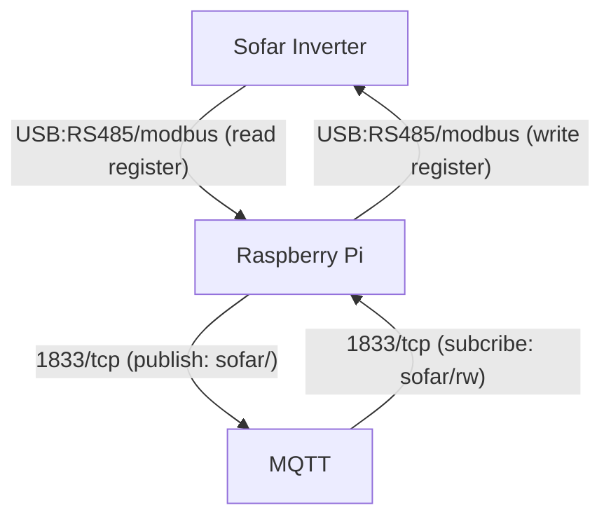
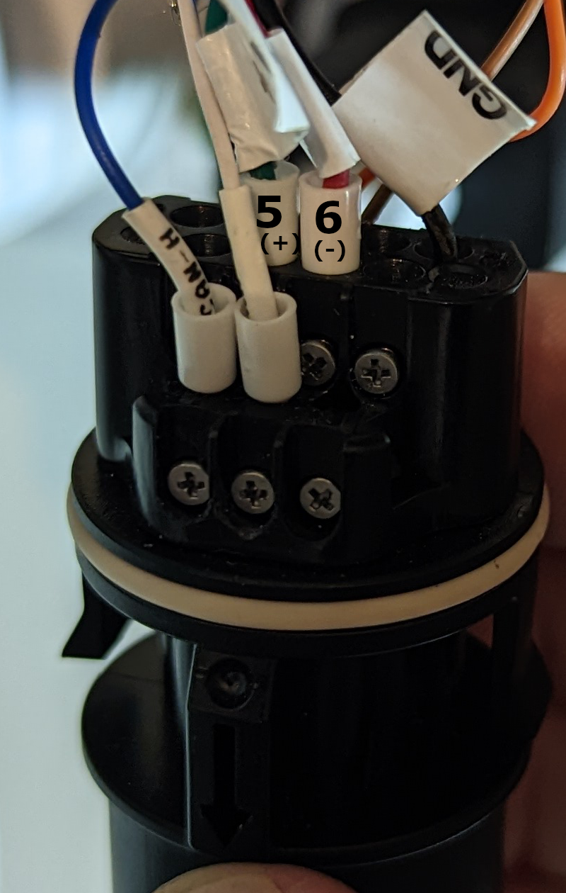
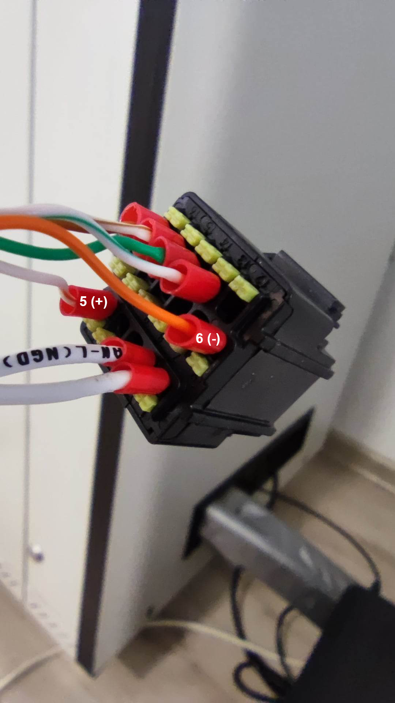
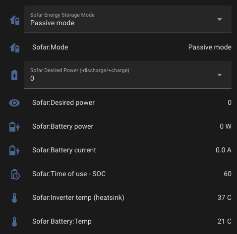

# Sofar2MQTT

## Overview

This project provides an integration between Sofar inverters over RS485 and MQTT.

It currently only support read and write operations.



## Inverter Compatability

This software is currently compatible with:

* Sofar ME3000
* Sofar HYD 3~6 EP

**Note:** It has only been tested on EP inverters.

There is no reason it cannot work with other Sofar inverters, the code and data have been seperately deliberately to support this you just need to provide the correct registers, see the following files:
* [sofar-hyd-ep.json](sofar-hyd-ep.json)
* [sofar-me-3000.json](sofar-me-3000.json)

Please do feel free to contribute changes and improvements.

## Requirements

1. RaspberryPi or some other nix device with Python 3.x installed.
1. RS485 to USB adapter
3. Existing MQTT server

If you want to do the same with ESP32 checkout the other [Sofar2Mqtt](https://github.com/cmcgerty/Sofar2mqtt) project

## Connecting the RS485/USB adapter

You will also need a RS485 to USB adapter, I use [this one](https://smile.amazon.co.uk/gp/product/B081NBCJRS) which is well built.  

You will need to connect the `A(+)` and `B(-)` connections according to your inverter. 

### Sofar ME3000SP and HYD 3~6k ES

Connect to the 485s port


Source: [setfirelabs.com](https://www.setfirelabs.com/green-energy/sofar-solar-me3000sp-firmware-upgrade-procedure)

### Sofar HYD 3~6 EP 

On the COM port you need to connect:
- Port 5 `A(+)`
- Port 6 `B(-)`
- Port 7 `GND (optional)`

#### Hardware Version 001



#### Hardware Version 003


Thanks for Pali.

## Installation

1. Clone the repo

    ```bash
    sudo apt-get install python-pip
    sudo pip install -r requirements.txt
    git clone https://gitlab.com/rjpearce/sofar2mqtt.git
    cd sofar2mqtt
    ```

1. Test you can communicate with your inverter

    ```bash
    python3 sofar2mqtt-v2.py --broker localhost --device /dev/ttyUSB0

    # Example of normal output
    INFO - MQTT connecting to broker
    INFO - MQTT connected
    INFO - Subscribing to sofar/rw/eps_control
    INFO - Subscribing to sofar/rw/remote_on_off_control
    INFO - Subscribing to sofar/rw/power_control
    INFO - Subscribing to sofar/rw/active_power_export_limit
    INFO - Subscribing to sofar/rw/active_power_import_limit
    INFO - Subscribing to sofar/rw/reactive_power_setting
    INFO - Subscribing to sofar/rw/power_factor_setting
    INFO - Subscribing to sofar/rw/active_power_limit_speed
    INFO - Subscribing to sofar/rw/reactive_power_response_time
    INFO - Subscribing to sofar/rw/energy_storage_mode
    INFO - Subscribing to sofar/rw/time_of_use_charge_soc
    INFO - Subscribing to sofar/rw/passive_timeout
    INFO - Subscribing to sofar/rw/passive_timeout_action
    INFO - Subscribing to sofar/rw/desired_power
    INFO - Subscribing to sofar/rw/minimum_battery_power
    INFO - Subscribing to sofar/rw/maximum_battery_power
    INFO - Subscribing to sofar/rw/desired_power_grid
    INFO - Modbus Requests: 62 Retries: 1 (1.61%) Failures: 0 (0.0%)
    ```
    
    NOTE:
      Modbus communication with HYD-EP model is rather unreliable, retry rates can be as high as 10%.
      However a retry is still a success if you get failures then something is probably wrong. 
      If you have any problems trying running with `--log-level DEBUG`


1. Install it as a service using systemd (optional)

    If you want to override any settingis you can set them in sofar2mqtt.service

    ```bash
    # Symlink the git clone directory to /opt/sofar2mqtt
    sudo ln -s $(pwd) /opt/sofar2mqtt
    # Copy the file to lib/systemd/system
    sudo cp systemd/sofar2mqtt.service /lib/systemd/system
    sudo chmod 644 /lib/systemd/system/sofar2mqtt.service
    # Reload daemon
    sudo systemctl daemon-reload
    # Enable the service (starts on boot and on failure)
    sudo systemctl enable sofar2mqtt
    # Start the service
    sudo systemctl start sofar2mqtt
    ```

1. Check the logs for output

    ```bash
    less /var/log/syslog
    ```

## Configuring persistent serial devices (optional):

If you have more than one serial device this can be very helpful to save the names switching around.

1. Identify your USB serial devices. See this [post](https://inegm.medium.com/persistent-names-for-usb-serial-devices-in-linux-dev-ttyusbx-dev-custom-name-fd49b5db9af1)
1. An example file is provided, see [99-usb-serial.rules](99-usb-serial.rules)
1. Copy the udev rules: `sudo cp 99-usb-serial.rules /etc/udev/rules.d/99-usb-serial.rules`

## Usage (if not running as a service)

```bash
# Run once and quit
python3 sofar2mqtt-v2.py --broker localhost --device /dev/ttyUSB0
```

```bash
Usage: sofar2mqtt-v2.py [OPTIONS]

  Main

Options:
  --config-file TEXT          Configuration file to use  [default: sofar-hyd-
                              ep.json]
  --daemon                    Run as a daemon
  --retry INTEGER             Number of read retries per register before
                              giving up  [default: 2]
  --retry-delay FLOAT         Delay before retrying read  [default: 0.1]
  --write-retry INTEGER       Number of write retries per register before
                              giving up  [default: 5]
  --write-retry-delay FLOAT   Delay before retrying write  [default: 2]
  --refresh-interval INTEGER  Refresh data every n seconds  [default: 5]
  --broker TEXT               MQTT broker address  [default: localhost]
  --port INTEGER              MQTT broker port  [default: 1883]
  --username TEXT             MQTT username
  --password TEXT             MQTT password
  --topic TEXT                MQTT topic for reading  [default: sofar/]
  --write-topic TEXT          MQTT topic for writing  [default: sofar/rw]
  --log-level [INFO|DEBUG]    Log Level  [default: INFO]
  --device TEXT               RS485/USB Device  [default: /dev/ttyUSB0]
  --help                      Show this message and exit.
```

To avoid passing sensitive data on the command line you can also set the username and password using enviroment variables: `MQTT_USERNAME` and `MQTT_PASSWORD`

## Write Support (BETA)

Note: This is still of a work in progress I have only tested `desired_power` and  `energy_storage_mode`.

By default the script will listen to the following topics:

```bash
  sofar/rw/eps_control
  sofar/rw/remote_on_off_control
  sofar/rw/power_control
  sofar/rw/active_power_export_limit
  sofar/rw/active_power_import_limit
  sofar/rw/reactive_power_setting
  sofar/rw/power_factor_setting
  sofar/rw/active_power_limit_speed
  sofar/rw/reactive_power_response_time
  sofar/rw/energy_storage_mode
  sofar/rw/time_of_use_charge_soc
  sofar/rw/passive_timeout
  sofar/rw/passive_timeout_action
  sofar/rw/desired_power
  sofar/rw/minimum_battery_power
  sofar/rw/maximum_battery_power
  sofar/rw/desired_power_grid
```

Note: `sofar/rw` is configurable via the `--write-topic` option.

```bash
# Install the mosquitto clients
sudo apt install mosquitto-clients

# Dump 1kW from the battery (inverter does nothing unless it is in Passive mode)
$ mosquitto_pub -h localhost -t sofar/rw/desired_power -m "-1000"

# Example output (/var/log/syslog)
INFO - Received a request for desired_power to set value to: -1000(-1000)
INFO - Writing 0x1187(4487) with -1000(-1000)
INFO - Modbus Write Request: desired_power successful. Retries: 1

# Set the invert to Passive mode
$ mosquitto_pub -h localhost -t sofar/rw/energy_storage_mode -m "Passive mode"

# Example output (/var/log/syslog)
INFO - Received a request for energy_storage_mode to set value to: Passive mode(3)
INFO - Writing 0x1110(4368) with 3(3)
INFO - Modbus Write Request: energy_storage_mode successful. Retries: 0
```

You can also do this directly from Home Assistant!

## Home Assistant Integration (includes write support)

Note: This is not currently available for the `sofar-me-3000.json` configuration, if you want to copy it across from the sofar-hyd-ep.json please be my guest! :) 

1. Make sure you have the [MQTT plugin](https://www.home-assistant.io/integrations/mqtt/) installed

1. Copy the configuration files from the ha folder (or symlink) them to you Home Assistant config folder.

    ```bash
    cp ha/{automations, mqtt}-sofar-hyd-ep.yaml <HA-CONFIG-FOLDER>
    ```

2. Add the following to your `configuration.yaml` to include it.

    ```bash
    mqtt: !include mqtt-sofar-hyd-ep.yaml
    automation sofar: !include automations-sofar-hyd-ep.yaml

    input_select:
      sofar_energy_storage_mode:
        name: Sofar Energy Storage Mode
        options:
          - "Self use"
          - "Time of use"
          - "Timing mode"
          - "Passive mode"
          - "Peak cut mode"
        icon: mdi:home-battery
      sofar_desired_power:
        name: Sofar Desired Power (-discharge/+charge)
        options:
          - "-5000"
          - "-4500"
          - "-4000"
          - "-3500"
          - "-3000"
          - "-2500"
          - "-2000"
          - "-1500"
          - "-1000"
          - "-500"
          - "0"
          - "500"
          - "1000"
          - "1500"
          - "2000"
          - "2500"
          - "3000"
          - "3500"
          - "4000"
          - "4500"
          - "5000"
        initial: "0"
        icon: mdi:battery-charging
    ```

1. Restart/Reload home assistant


### Example usage

[](img/ha-integration.webm)
[Click here to watch the video](img/ha-integration.webm)

NOTE: The slightly weird behaviour of desired power when in `Self use`, it is probably best to only change it when you are in `Passive mode`.

## Home Assistant Notifications

Below are some notifications that you might find useful to keep an eye on your Sofar inverter and Batteries.

### Notify on Sofar mode change

```yaml
alias: Notify on Sofar mode change
description: ""
trigger:
  - platform: state
    entity_id:
      - sensor.sofar_mode
condition: []
action:
  - service: notify.mobile_app_device
    data:
      title: Sofar mode has changed
      message: "{{ states('sensor.sofar_mode') }}"
      data:
        channel: Sofar Mode
        ttl: 0
        priority: high
        importance: high
        vibrationPattern: 1, 1, 1, 1, 1
        ledColor: red
        alert_once: true
        notification_icon: mdi:alert-circle
mode: single
```

### Notify on Sofar SOC change

```yaml
alias: Notify on Sofar SOC change
description: ""
trigger:
  - platform: state
    entity_id:
      - sensor.sofar_battery_soc
condition: []
action:
  - service: notify.mobile_app_device
    data:
      title: Sofar Battery
      message: "SOC: {{ states('sensor.sofar_battery_soc')}}%"
      data:
        channel: Sofar Battery
        persistent: true
        notification_icon: mdi:battery-charging-outline
        importance: low
        tag: persistent
mode: single
```

### Notify when Sofar Inverter State changes

```yaml
alias: Notify when Sofar Inverter State changes
description: ""
trigger:
  - platform: state
    entity_id:
      - sensor.sofar_inverter_state
condition: []
action:
  - service: notify.mobile_app_device
    data:
      title: Sofar mode has changed
      message: "{{ states('sensor.sofar_mode') }}"
      data:
        channel: Sofar Mode
        ttl: 0
        priority: high
        importance: high
        vibrationPattern: 1, 1, 1, 1, 1
        ledColor: red
        alert_once: true
        notification_icon: mdi:alert-circle
mode: single
```

### Notify when Sofar data has not changed

```yaml
alias: Notify when Sofar data has not changed
description: ""
trigger:
  - platform: template
    value_template: >-
      {{ now() - states.sensor.sofar_house_consumption_now.last_changed >=
      timedelta (minutes=10) }}
action:
  - service: notify.mobile_app_device
    data:
      title: Sofar data is stale
      message: "{{ states.sensor.sofar_house_consumption_now.last_changed }}"
      data:
        channel: Sofar Stale
        importance: high
        vibrationPattern: 100, 1000, 100, 1000, 100
        ledColor: red
        alert_once: true
        notification_icon: mdi:alert-circle
mode: single
```

## Known Issues

1. The desired_power control in Home Assistant does not update based on the actual setting in the inverter.
The inverter always returns 0 and I don't know why.
2. There are other modbus addresses that should be writable eg. Time of use SOC but they are not. I need to follow up with Sofar support to find out why.

## Credits

Based on a script originally created by Matt Nichols in 2021.
Thank you to Andre Wagner to his example write python code.
Thank you everyone on the [Sofar Solar Inverter - Remote Control & Smart Home Integration](https://www.facebook.com/groups/2477195449252168) Facebook group.

## Support

You can ping me directly on here or the awesome [Sofar Solar Inverter - Remote Control & Smart Home Integration](https://www.facebook.com/groups/2477195449252168) Facebook group

## Other interesting projects

* [Sofar2Mqtt - Using an ESP32 device to read from the inverter and send to MQTT](https://github.com/cmcgerty/Sofar2mqtt)
* [M5Stack Core2 MQTT Solar Display - DIY Solar display to show MQTT data](https://gitlab.com/rjpearce/m5stack-core2-mqtt-solar-display)
