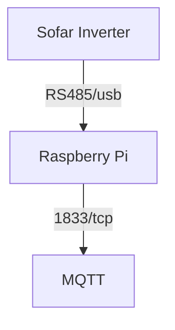
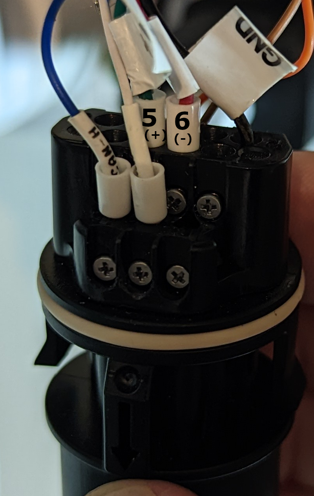

# Sofar2MQTT

## Overview

This project provides an integration between Sofar inverters over RS485 and MQTT.

It currently only support read operations.



## Inverter Compatability

This software is currently compatible with:

* Sofar ME3000
* Sofar HYD 3~6 EP

**Note:** It has only been tested on EP inverters.

There is no reason it cannot work with other Sofar inverters, the code and data have been seperately deliberately to support this you just need to provide the correct registers, see the following files:
* [sofar-hyd-ep.json](sofar-hyd-ep.json)
* [sofar-me-3000.json](sofar-me-3000.json)

Please do feel free to contribute changes and improvements.

## Requirements

1. RaspberryPi or some other nix device with Python 3.x installed.
1. RS485 to USB adapter
3. Existing MQTT server

If you want to do the same with ESP32 checkout the other [Sofar2Mqtt](https://github.com/cmcgerty/Sofar2mqtt) project

## Connecting the RS485/USB adapter

You will also need a RS485 to USB adapter, I use [this one](https://smile.amazon.co.uk/gp/product/B081NBCJRS) which is well built.  

You will need to connect the `A(+)` and `B(-)` connections according to your inverter. 

### Sofar ME3000SP and HYD 3~6k ES

Connect to the 485s port


Source: [setfirelabs.com](https://www.setfirelabs.com/green-energy/sofar-solar-me3000sp-firmware-upgrade-procedure)

### Sofar HYD 3~6 EP 

On the COM port you need to connect:
- Port 5 `A(+)`
- Port 6 `B(-)`
- Port 7 `GND (optional)`


## Basic Installation

```bash
sudo apt-get install python-pip
sudo pip install -r requirements.txt
git clone https://gitlab.com/rjpearce/sofar2mqtt.git
cd sofar2mqtt
```

## Usage

```bash
# Run once and quit
python3 sofar2mqtt-v2.py --broker localhost --device /dev/ttyUSB0
```

If you want to run it on a regular basis you can either use crontab, the systemd script or --daemon

```bash
# Run forever
python3 sofar2mqtt-v2.py --broker localhost --device /dev/ttyUSB0 --daemon
```

```bash
Usage: sofar2mqtt-v2.py [OPTIONS]

  Main

Options:
  --config-file TEXT          Configuration file to use  [default: sofar-hyd-
                              ep.json]
  --daemon                    Run as a daemon
  --retry INTEGER             Number of read retries per register before
                              giving up  [default: 1]
  --retry-delay FLOAT         Delay before retrying read  [default: 0.5]
  --refresh-interval INTEGER  Refresh data every n seconds  [default: 10]
  --broker TEXT               MQTT broker address  [default: localhost]
  --port INTEGER              MQTT broker port  [default: 1883]
  --username TEXT             MQTT username
  --password TEXT             MQTT password
  --topic TEXT                MQTT topic  [default: sofar/]
  --log-level [INFO|DEBUG]    Log Level  [default: INFO]
  --device TEXT               RS485/USB Device  [default: /dev/ttyUSB0]
  --help                      Show this message and exit.
```

To avoid passing sensitivie data on the command line you can also set the username and password using enviroment variables: `MQTT_USERNAME` and `MQTT_PASSWORD`


## Advanced Installation 

### Configuring persistent serial devices:

1. Identify your USB serial devices. See this [post](https://inegm.medium.com/persistent-names-for-usb-serial-devices-in-linux-dev-ttyusbx-dev-custom-name-fd49b5db9af1)
1. An example file is provided, see [99-usb-serial.rules](99-usb-serial.rules)
1. Copy the udev rules: `sudo cp 99-usb-serial.rules /etc/udev/rules.d/99-usb-serial.rules`

### Configuring Home Assistant

An example configuration file to configure Home Assistant can be found in the [ha](ha/) folder.

### Installing it as a service using systemd

Option 1 - Create a symlink from the /opt/sofar2mqtt to the directory where you git cloned sofar2mqtt
Option 2 - Edit systemd/sofar2mqtt.service update the path 

```bash
sudo cp systemd/sofar2mqtt.service /lib/systemd/system
sudo chmod 644 /lib/systemd/system/sofar2mqtt.service
sudo systemctl daemon-reload
sudo systemctl enable sofar2mqtt
sudo systemctl start sofar2mqtt
```

## Support

You can ping me directly on here or the awesome [Sofar Solar Inverter - Remote Control & Smart Home Integration](https://www.facebook.com/groups/2477195449252168) Facebook group

## Other interesting projects

* [Sofar2Mqtt - Using an ESP32 device to read from the inverter and send to MQTT](https://github.com/cmcgerty/Sofar2mqtt)
* [M5Stack Core2 MQTT Solar Display - DIY Solar display to show MQTT data](https://gitlab.com/rjpearce/m5stack-core2-mqtt-solar-display)
